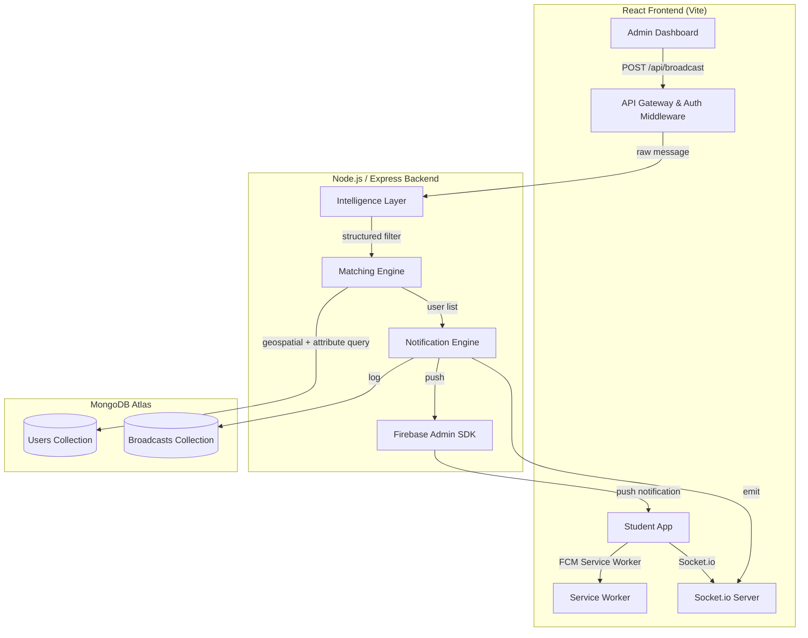
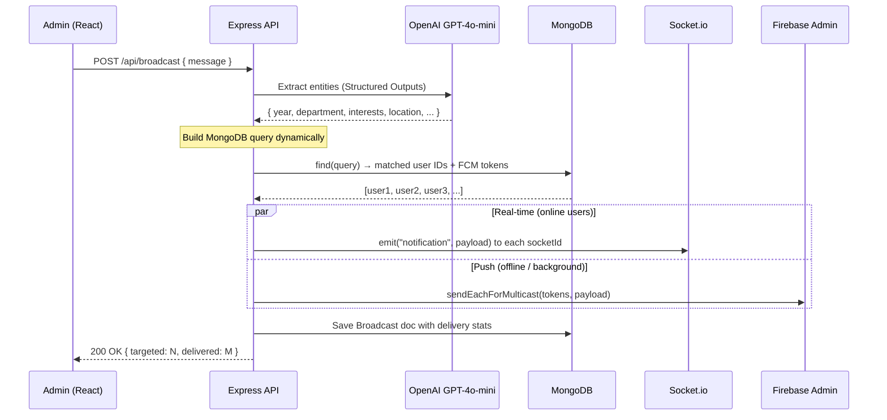

# Smart Broadcasting System — Technical Blueprint

## 1. High-Level System Architecture



**Data flow in one sentence:** Admin types a message → backend calls OpenAI → entities extracted → MongoDB query built → matching users fetched → Socket.io + FCM deliver the notification.

---

## 2. The Intelligence Layer (NLP / Entity Extraction)

### Recommended Model: **OpenAI GPT-4o-mini** via Structured Outputs

**Why GPT-4o-mini?**
- Cheapest OpenAI model that supports **Structured Outputs** (`response_format: { type: "json_schema" }`)
- Fast enough for real-time use (~300 ms per call)
- Accurate entity extraction with a well-defined JSON schema
- No GPU infrastructure to manage (API-based)

### Extraction Schema (sent to OpenAI)

```jsonc
{
  "name": "broadcast_entities",
  "strict": true,
  "schema": {
    "type": "object",
    "properties": {
      "year":        { "type": ["integer","null"], "description": "Academic year 1-4, null if not mentioned" },
      "department":  { "type": ["string","null"],  "description": "Canonical department code: CSE, AIML, AIDS, ECE, ME, etc." },
      "interests":   { "type": "array", "items": { "type": "string" }, "description": "Lowercase interest tags e.g. dance, coding, robotics" },
      "location":    {
        "type": ["object","null"],
        "properties": {
          "label":     { "type": "string" },
          "latitude":  { "type": "number" },
          "longitude": { "type": "number" },
          "radiusKm":  { "type": "number", "description": "Default 0.5 km if unspecified" }
        },
        "required": ["label","latitude","longitude","radiusKm"]
      },
      "urgency":     { "type": "string", "enum": ["low","medium","high"] },
      "summary":     { "type": "string", "description": "One-line cleaned summary for the notification body" }
    },
    "required": ["year","department","interests","location","urgency","summary"],
    "additionalProperties": false
  }
}
```

**Example input → output:**

| Admin types | Extracted JSON |
|---|---|
| *"First-year AI&DS students interested in dance, please visit the auditorium"* | `{ year:1, department:"AIDS", interests:["dance"], location:{label:"Auditorium", lat:12.97, lng:80.04, radiusKm:0.5}, urgency:"medium", summary:"Please visit the auditorium for a dance-related event" }` |

> [!TIP]
> For the location field, maintain a **campus landmarks lookup table** (Auditorium → lat/lng, Library → lat/lng, etc.) and pass it as context in the system prompt so the model can resolve named places to coordinates.

---

## 3. MongoDB Schemas

### 3.1 User Schema

```js
// models/User.js
const userSchema = new mongoose.Schema({
  // Auth
  name:       { type: String, required: true },
  email:      { type: String, required: true, unique: true },
  password:   { type: String, required: true },           // bcrypt hash
  role:       { type: String, enum: ['student','admin'], default: 'student' },

  // Academic profile
  year:       { type: Number, enum: [1,2,3,4] },
  department: { type: String, enum: ['CSE','AIML','AIDS','ECE','ME','CE','EEE'] },

  // Interests (lowercase tags)
  interests:  [{ type: String }],                         // e.g. ['dance','coding']

  // Geolocation — GeoJSON Point for $nearSphere queries
  location: {
    type:        { type: String, enum: ['Point'], default: 'Point' },
    coordinates: { type: [Number], default: [0, 0] }      // [lng, lat]
  },
  locationUpdatedAt: { type: Date },

  // Push tokens
  fcmTokens:  [{ type: String }],                         // one per device/browser
  socketId:   { type: String },                            // current Socket.io session

}, { timestamps: true });

// 2dsphere index for geospatial queries
userSchema.index({ location: '2dsphere' });
// Compound index for fast attribute filtering
userSchema.index({ year: 1, department: 1 });
```

### 3.2 Broadcast Schema

```js
// models/Broadcast.js
const broadcastSchema = new mongoose.Schema({
  adminId:       { type: mongoose.Schema.Types.ObjectId, ref: 'User' },
  rawMessage:    { type: String, required: true },
  extractedEntities: { type: Object },                    // AI output JSON
  mongoQuery:    { type: Object },                        // the query that was run
  matchedUsers:  [{ type: mongoose.Schema.Types.ObjectId, ref: 'User' }],
  deliveryStats: {
    targeted: Number,
    socketDelivered: Number,
    fcmDelivered: Number,
    failed: Number
  },
  status: { type: String, enum: ['processing','sent','failed'], default: 'processing' },
}, { timestamps: true });
```

### 3.3 Geospatial Strategy

MongoDB's `$nearSphere` with a `2dsphere` index uses the **Haversine formula** internally — no manual math needed.

```js
// Example: find users within 500 m of the auditorium
db.users.find({
  location: {
    $nearSphere: {
      $geometry: { type: "Point", coordinates: [80.04, 12.97] },
      $maxDistance: 500   // meters
    }
  }
});
```

> [!IMPORTANT]
> GeoJSON coordinates are `[longitude, latitude]` — opposite of Google Maps order.

---

## 4. Logic Workflow (End-to-End)



### Step-by-step:

1. **Admin sends message** → `POST /api/broadcast` with `{ message: "..." }`
2. **Auth middleware** verifies JWT, confirms admin role
3. **Intelligence Layer** calls OpenAI with the message + campus-landmark context → returns structured entities
4. **Query Builder** constructs a dynamic MongoDB filter:
   ```js
   const filter = {};
   if (entities.year)        filter.year = entities.year;
   if (entities.department)  filter.department = entities.department;
   if (entities.interests.length)
     filter.interests = { $in: entities.interests };
   if (entities.location)
     filter.location = {
       $nearSphere: {
         $geometry: { type: 'Point', coordinates: [entities.location.longitude, entities.location.latitude] },
         $maxDistance: entities.location.radiusKm * 1000
       }
     };
   ```
5. **Matching Engine** runs `User.find(filter)` → returns matched users
6. **Notification Engine** fans out:
   - **Socket.io**: emit to each user's `socketId` (real-time, online users)
   - **FCM**: `admin.messaging().sendEachForMulticast()` for offline/background users
7. **Broadcast doc** is saved with delivery stats
8. **Admin dashboard** receives a 200 response with stats

---

## 5. Tech Stack Summary

| Layer | Technology | Purpose |
|---|---|---|
| Frontend | React 19 + Vite | Admin dashboard & student notification UI |
| Styling | Vanilla CSS (dark theme, glassmorphism) | Premium UI |
| Backend | Node.js 22 + Express 5 | REST API + orchestration |
| Database | MongoDB Atlas (7.x) | User profiles, broadcasts, geospatial queries |
| ODM | Mongoose 8 | Schema validation & indexing |
| AI/NLP | OpenAI GPT-4o-mini (Structured Outputs) | Entity extraction from natural language |
| Real-time | Socket.io 4 | Live in-app notifications |
| Push | Firebase Cloud Messaging (FCM) | Background/offline push notifications |
| Auth | JWT + bcrypt | Stateless authentication |
| Geolocation | Browser Geolocation API + MongoDB 2dsphere | Location tracking & proximity matching |

---

## 6. Project Folder Structure

```
antigravity/
├── client/                          # React (Vite)
│   ├── public/
│   │   └── firebase-messaging-sw.js # FCM service worker
│   ├── src/
│   │   ├── api/                     # Axios instances
│   │   ├── components/              # Reusable UI components
│   │   ├── pages/
│   │   │   ├── AdminDashboard.jsx   # Compose & send broadcasts
│   │   │   ├── Login.jsx
│   │   │   ├── Register.jsx
│   │   │   └── StudentHome.jsx      # Notification feed
│   │   ├── context/                 # Auth & Socket context
│   │   ├── hooks/                   # useFCM, useSocket, useAuth
│   │   ├── App.jsx
│   │   ├── main.jsx
│   │   └── index.css
│   ├── index.html
│   ├── vite.config.js
│   └── package.json
│
├── server/                          # Node.js / Express
│   ├── config/
│   │   ├── db.js                    # MongoDB connection
│   │   ├── firebase.js              # Firebase Admin init
│   │   └── openai.js                # OpenAI client init
│   ├── middleware/
│   │   └── auth.js                  # JWT verification
│   ├── models/
│   │   ├── User.js
│   │   └── Broadcast.js
│   ├── services/
│   │   ├── intelligenceService.js   # OpenAI entity extraction
│   │   ├── matchingService.js       # Dynamic query builder
│   │   └── notificationService.js   # Socket.io + FCM dispatch
│   ├── routes/
│   │   ├── authRoutes.js
│   │   ├── broadcastRoutes.js
│   │   └── userRoutes.js
│   ├── socket/
│   │   └── socketHandler.js         # Socket.io connection mgmt
│   ├── data/
│   │   └── campusLandmarks.json     # Auditorium, Library → lat/lng
│   ├── server.js                    # Entry point
│   └── package.json
│
├── .env.example
├── .gitignore
└── README.md
```

---

## 7. Scalability Considerations

| Concern | Solution |
|---|---|
| Many concurrent Socket.io connections | Use Redis adapter (`@socket.io/redis-adapter`) to scale across multiple Node processes |
| High FCM volume | Batch with `sendEachForMulticast()` (max 500 tokens per call), queue with Bull/BullMQ for large audiences |
| OpenAI rate limits | Cache identical/similar queries; use exponential backoff |
| Location updates flooding DB | Throttle client-side updates to once per 30 seconds; use `locationUpdatedAt` to skip stale updates |
| Large user base filtering | Compound indexes on `{ year, department }` + `2dsphere` on `location` |

---

## Open Questions

> [!IMPORTANT]
> **1. OpenAI API Key** — Do you already have an OpenAI API key, or would you prefer a free alternative (e.g., Google Gemini API free tier or a local Ollama model)?

> [!IMPORTANT]
> **2. Firebase Project** — Do you have a Firebase project set up, or should we create one from scratch?

> [!IMPORTANT]
> **3. MongoDB** — Will you use MongoDB Atlas (cloud) or a local MongoDB instance?

> [!IMPORTANT]
> **4. Campus Landmarks** — Can you provide a list of key campus locations with their lat/lng coordinates (Auditorium, Library, Lab blocks, etc.)?

> [!IMPORTANT]
> **5. Department List** — What are the exact department codes at your university?

---

## Verification Plan

### Automated Tests
- Unit tests for `intelligenceService.js` (mock OpenAI, verify schema output)
- Unit tests for `matchingService.js` (verify query construction for various entity combos)
- Integration test: seed 50 users → send broadcast → verify only matching users receive notification

### Manual Verification
- Admin sends a broadcast in the browser → verify real-time Socket.io notification on a student's browser
- Close the student's tab → re-send → verify FCM push notification appears
- Test geospatial: two students at different coordinates, broadcast targets one location → only the nearby student is notified
