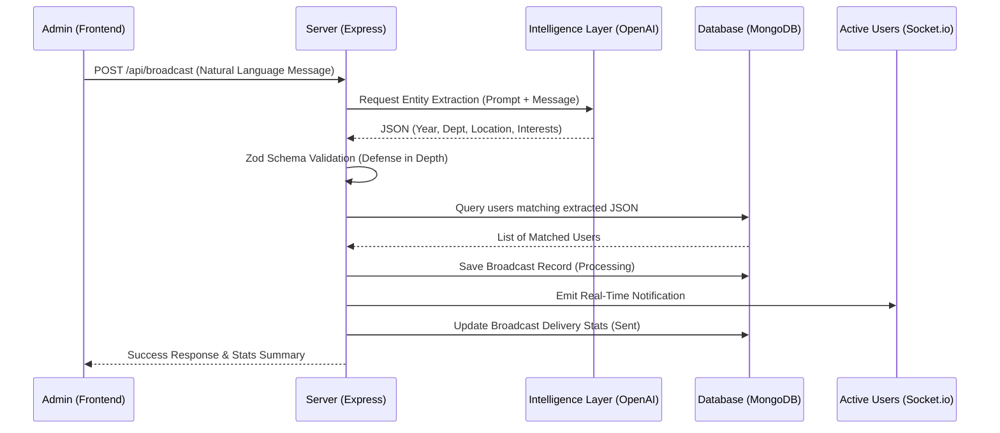
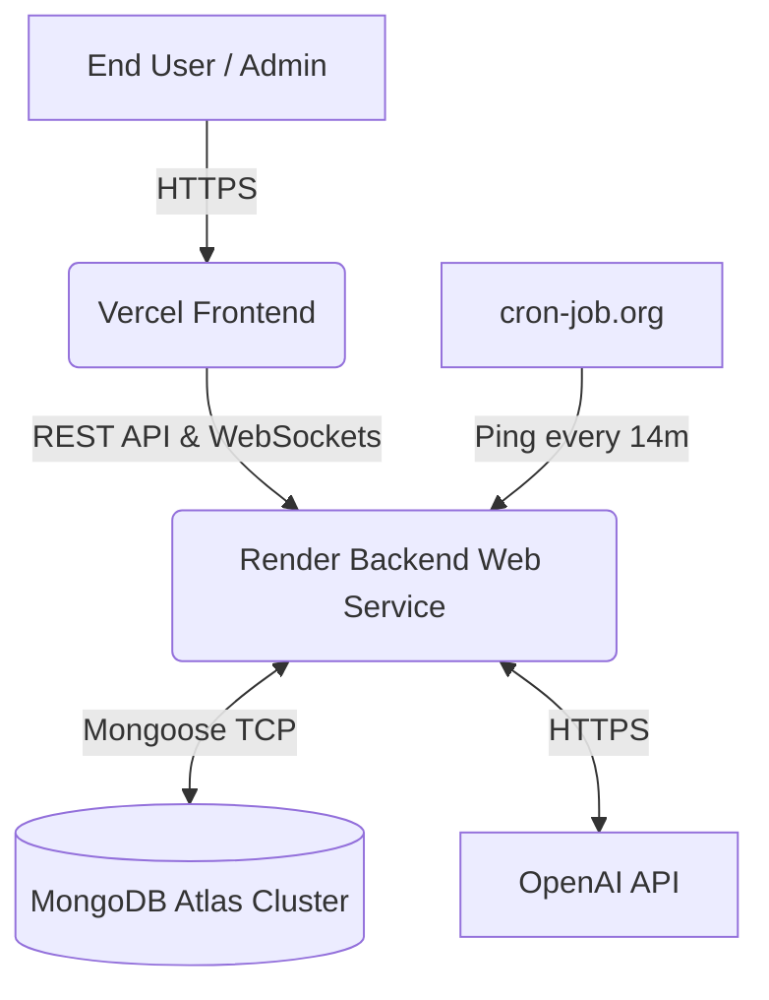

# Smart Broadcasting System (SmartCast)
**Comprehensive Project Report**

---

## 1. Project Overview & Objective
The **Smart Broadcasting System** is an AI-powered, real-time notification platform designed for university or corporate environments. Traditional broadcasting systems require administrators to manually filter databases to select target audiences. This system introduces an **Intelligence Layer** that allows administrators to type natural language messages (e.g., *"First-year AI&DS students interested in dance, please visit the auditorium"*). The AI automatically parses the message, extracts the target demographics, and routes the notification exclusively to matching users in real-time.

---

## 2. Technology Stack

The project is built on a modernized **MERN Stack**:
- **Frontend:** React.js (via Vite) for a blazing-fast SPA, vanilla CSS for highly customized, responsive, and animated UI design.
- **Backend:** Node.js & Express.js, providing robust REST APIs.
- **Database:** MongoDB Atlas, offering a scalable NoSQL database for flexible user profiles and real-time query matching.
- **Real-Time Engine:** Socket.io for instant push notifications to active clients.
- **AI Integration:** OpenAI API (GPT-4o/GPT-3.5) for Natural Language Processing and entity extraction.
- **Validation:** Zod for strict schema validation on user inputs and AI outputs.

---

## 3. System Architecture & Data Flow

The system consists of three main phases: Entity Extraction, Matching, and Dispatch.

### Flowchart: Deployment Architecture

---

## 4. Key Features & Implementation Details

### A. The Intelligence Layer
Using **OpenAI's API**, the backend interprets natural text and outputs a strictly typed JSON structure containing `year`, `department`, `interests`, `location`, and `urgency`. If the AI fails or hits a rate limit, the system gracefully degrades to a local regex-based fallback extractor to ensure high availability.

### B. Real-Time Dispatch & Feedback Loop
- **Socket.io** enables instantaneous delivery of notifications.
- **Relevance Feedback:** Users can vote 👍 (Relevant) or 👎 (Irrelevant) on notifications. This feeds into the **Analytics Dashboard**, displaying an "AI Accuracy %" to the administrator to track engagement and model precision.

### C. Progressive Web App (PWA)
The application includes a `manifest.json` and a Service Worker (`sw.js`). This allows users to install the app on mobile devices. When the app is in the background, incoming Socket events trigger native OS push notifications.

---

## 5. Security & Production Hardening

Before deployment, the system underwent severe security hardening:

1. **Authentication:** Implemented **JWT Refresh Token Rotation**. Access tokens (15-min life) are stored in JS memory, while Refresh tokens (7-day life) are stored in secure, `httpOnly` cookies to prevent XSS attacks.
2. **Rate Limiting:** Granular rate limits using `express-rate-limit` (e.g., 5 requests/15 mins for login, 10 requests/min for broadcasts, 100 requests/15 mins for general APIs) to mitigate DDoS and brute-force attacks.
3. **Validation & Sanitization:** 
   - `helmet` secures HTTP headers.
   - A custom NoSQL injection sanitizer ensures malicious queries are stripped before hitting MongoDB.
   - `zod` guarantees payload structures, completely neutralizing malformed data crashes.
4. **CORS Configuration:** Strictly locked down to the Vercel frontend domain.

---

## 6. Deployment Infrastructure

### A. Vercel (Frontend)
- **Repo Connection:** Automatically builds the React/Vite app on GitHub pushes.
- **Configuration:** `vercel.json` ensures SPA (Single Page Application) routing rewrites all paths to `index.html`.
- **Environment Variables:** `VITE_API_URL` and `VITE_SOCKET_URL` point to the Render backend.

### B. Render (Backend)
- **Web Service Engine:** Node.js runtime executing `server.js`.
- **Environment Variables:** Securely injects DB connection strings, JWT secrets, and API keys.
- **Cold Start Mitigation:** Render's free tier spins down servers after 15 minutes of inactivity. To prevent this, a scheduled task on **cron-job.org** sends an HTTP GET request to the `/api/health` endpoint every 14 minutes.

### C. MongoDB Atlas (Database)
- A cloud-hosted M0 Free Cluster provides high availability and automated backups.
- Configured with `0.0.0.0/0` network access to allow Render's dynamic IP addresses to connect.

---

## 7. Environment Variables & API Keys Reference

The system relies on securely managed environment variables. *Note: Actual keys must never be committed to version control.*

| Variable Name | Purpose / Description | Platform |
|---|---|---|
| `MONGODB_URI` | The connection string for the Atlas Cluster. | Render |
| `JWT_SECRET` | Cryptographic key to sign short-lived access tokens. | Render |
| `JWT_REFRESH_SECRET` | Cryptographic key to sign long-lived refresh tokens. | Render |
| `OPENAI_API_KEY` | Secret key provided by OpenAI for NLP entity extraction. | Render |
| `CLIENT_URL` | The Vercel URL. Used to configure strict CORS policies. | Render |
| `VITE_API_URL` | The Render URL appended with `/api`. Directs Axios requests. | Vercel |
| `VITE_SOCKET_URL` | The base Render URL. Directs Socket.io connections. | Vercel |

---

## 8. Conclusion & Future Scope
The Smart Broadcasting System successfully transitions static, manual notifications into a dynamic, AI-driven workflow. The production-ready architecture ensures it is secure, highly performant (Vite code-splitting), and scalable.

**Future Enhancements:**
- Integration with institutional SSO (Single Sign-On).
- Using advanced geospatial queries (MongoDB `$near`) to target users dynamically moving around campus.
- Web Push API integration for offline push notifications.
