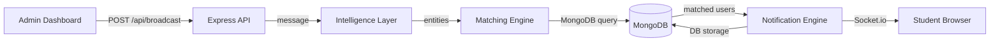

# Smart Broadcasting System — Walkthrough

## What Was Built

A full-stack **MERN application** with AI-powered message routing. An admin types a natural language message, the system extracts entities (year, department, interests, location), queries MongoDB for matching student profiles, and delivers notifications via Socket.io.

---

## Architecture



---

## Verified Test Results

### Login Page


### Admin Dashboard (Before Broadcast)


### Broadcast Result — AI Entity Extraction


**Test message:** *"First-year AI&DS students interested in dance, please visit the auditorium"*

| Entity | Extracted Value |
|---|---|
| Year | 1 |
| Department | AIDS |
| Interests | dance |
| Location | Main Auditorium |
| Urgency | medium |
| **Matched Users** | **3** (Aarav, Priya, Sneha — all 1st year AIDS with dance interest) |

### Full Flow Recording


---

## Project Structure

```
antigravity/
├── server/                    # Node.js + Express backend
│   ├── config/                # DB, OpenAI configs
│   ├── middleware/             # JWT auth
│   ├── models/                # User, Broadcast, Notification
│   ├── services/              # intelligence, matching, notification
│   ├── routes/                # auth, broadcast, user
│   ├── socket/                # Socket.io handler
│   ├── data/                  # Campus landmarks
│   ├── server.js              # Entry point
│   └── seed.js                # Test data seeder
├── client/                    # React (Vite) frontend
│   └── src/
│       ├── api/               # Axios instance
│       ├── context/           # Auth + Socket context
│       ├── components/        # Navbar
│       └── pages/             # Login, Register, AdminDashboard, StudentHome
└── .gitignore
```

---

## How to Run

```bash
# 1. Ensure MongoDB is running locally on port 27017

# 2. Start the server
cd server
npm install
node seed.js          # Seed test users (admin@smart.edu / admin123)
node server.js        # Runs on port 5000

# 3. Start the client
cd client
npm install
npm run dev           # Runs on port 5173

# 4. Open http://localhost:5173
```

**Test credentials:**
- Admin: `admin@smart.edu` / `admin123`
- Student: `aarav@smart.edu` / `pass123` (1st year AIDS, interests: dance, music)

---

## Next Steps

1. **Add a real OpenAI API key** to `server/.env` → AI extraction upgrades from regex to GPT-4o-mini
2. **Test student view** — login as a student to see notifications appear
3. **Deploy** — MongoDB Atlas + Railway/Render for backend, Vercel for frontend
